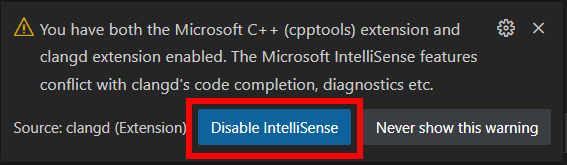

import VSCodeExtension from "@site/components/VSCodeExtension"

If you are familiar with *IntelliSense* (which is installed by default in Visual Studio and Visual Studio Code), *clangd* is the same kind of thing, but better (less laggy, more complete). It will provide autocompletion, suggestions, detect bugs, etc.

- First, install the clangd extension: <VSCodeExtension id="llvm-vs-code-extensions.vscode-clangd"/>. 
- It should then prompt you to disable IntelliSense, **say yes**. If you miss that step, go in the Settings, search for `C_Cpp.intelliSenseEngine` and set it to `Disabled`.

- It should then prompt you to download the actual language server, **say yes**.
- Now go to your Settings (<kbd>CTRL</kbd>+<kbd>,</kbd>), search for `clangd arguments` and add `--compile-commands-dir=${workspaceFolder}/build`

You should now be good to go! (If VSCode is not able to provide autocompletion, then something went wrong during the installation of *clangd*.)
