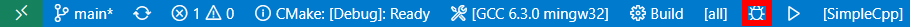
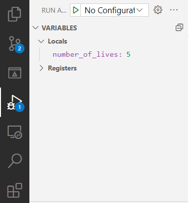
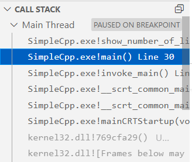

import VSCodeExtension from "@site/components/VSCodeExtension"

If your code crashes, running it with a debugger will indicate you the exact place where it crashes. You will also be able to inspect the value of all the variables of the program, and see which functions were called before the one that caused the crash.

## How to

### Running your debugger

If you are using VS Code and the CMake extension (<VSCodeExtension id="ms-vscode.cmake-tools"/>), then you can simply click on the little bug in your toolbar:

If you are using something else, go look for the info! All IDEs come with a debugger and an easy way of launching it.

### Setting breakpoints

Even if you don't have a crash in your program, you might want to see what is going on if for example a function doesn't behave as expected. You can set a breakpoint, usually by clicking on the left of the line

### Inspecting the state of your program

Once your program paused on a breakpoint or a crash, you can see the value of all variables (by hovering over them or looking at the variables window):

You can also see all the functions that have been called previously, called the call stack, and jump to them:

Finally, you can keep executing the program step by step and see what happens:

