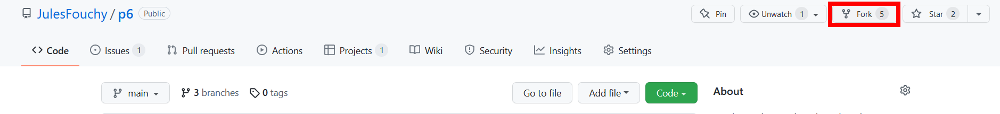
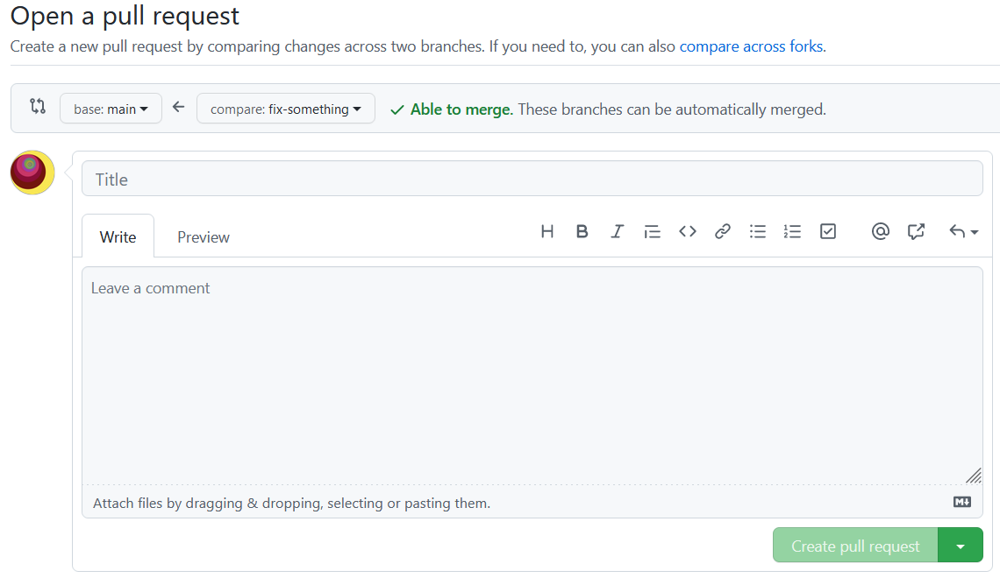

## Brief

Sometimes you want to contribute to an open-source project but you don't have the right to commit directly on that repo. That's normal and you can still contribute via *pull requests* (abbreviated as *PR*) (also known as *merge requests* on GitLab).

## How to

### Fork

You will have to *fork* the repository: this will make a copy of this repository under your profile, so that you will be able to commit on that copied repo. Once you have done your commits, you can ask to merge them into the original repo. It will be up to the maintainers of the repo to decide if they want to accept your pull request. Sometimes they will ask you to tweak or improve a few things before accepting your commits.

### Make a dedicated branch

Every commit you make, even after the pull request is created, will still be included in the PR. So you should make a branch dedicated to that pull request and only commit on that branch the things you want to be included in the PR. Then you can keep working **on another branch** if you want to modify that repo further, and it won't disturb the PR.

### Write a nice message

When you create your pull request you will be given the opportunity to explain what you changed, and why you changed it. A great explanation will increase your chances of seeing your PR reviewed, and maybe merged.

:::tip
Don't be afraid to point out the areas where you are not sure of your changes. The maintainers will likely be able to help you and indicate how you can improve your pull request before they merge it. 
To update your pull request after their feedback, simply make new commits on the branch that you submitted for PR and it will update automatically.
:::

## Also

Sometimes you will also make pull requests inside the same repo, for example when you want to merge the branch you have been working on into *main*: instead of merging directly you will create a pull request and ask for the review of some other developers before merging anything.