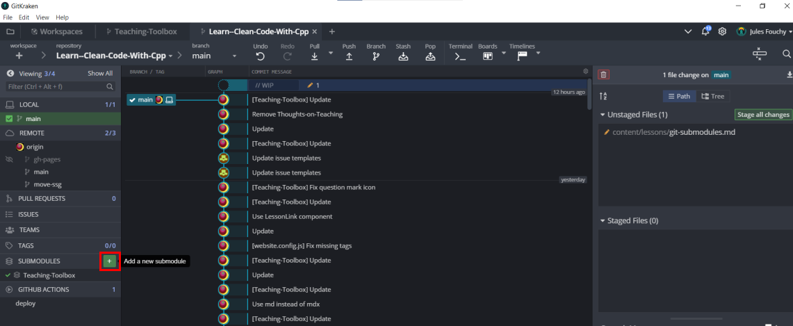

## Brief

Submodules are used to link to other repositories: instead of copying a library into your project, you can use a submodule to keep a reference to the original repository. This has several advantages:
- It doesn't take space on your repo: it is merely a link and people can download it if they want to
- It is easier to update: you simply have to pull from the original repository
- You always know which version of the library you are using: it is written in the Git submodule
- If this is a library that you are developing, you can make the modifications in the project that uses the library, and then push to the repo of the library! This is the biggest selling point to me because it means that you can, in one place, work on the library and the project that uses it. It feels like you have one repo even though there are actually two and one of them can be shared across many projects.

## Adding a submodule

With GitKraken you can simply click the *Add submodule* button and then specify the url of the repo and the folder where you want to clone the submodule:



With the command line you can do:

```
git submodule add https://github.com/url/to/the/repo folder/where/to/clone
git submodule update --init --recursive
```

## Cloning a project that uses a submodule

It doesn't work really well with GitKraken so I recommend to do that step with the command line:
```
git clone --recursive https://github.com/url/to/the/repo
```

If you forget to use that `--recursive` flag, the submodules won't be cloned. To fix that you can always do:

```
git submodule update --init --recursive
```