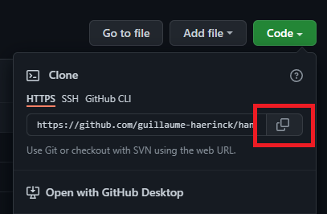

import LessonLink from "@site/components/LessonLink"

## Brief

*git* is probably the most important tool of all in your programmer toolbelt! It is a software which is able to handle a giant history of all the changes you ever made to your code. It is very powerful to work with other developers and split your tasks.[^1]

[^1]: NB: There are many other software versioning solutions out there, but *git* is by far the most popular one.

## Why bother?

There are a few reasons to use *git*:

- **revert**: Go back in time to a working state if you broke something.
- **checkout**: Check how the project was at a given date.
- **commit**: Be able to work step-by-step by grouping your changes with a description.
- **blame**: Be able to know when a line of code was added, and by whom.
- **push**: Have a copy of your code on a server so that other developers can get it.
- **pull**: Get changes made by other developers.


## Good practices

### Small commits

:::tip Guideline
As soon as you have made some progress and the code compiles, make a commit!

Try to avoid putting *unrelated* changes in the same commit: split them over several commits.
:::

### Clear messages and descriptions

:::tip Guideline
Don't be lazy, write actual sentences without stripping words!<br/>
In the description, explain *why* you are making the change.<br/>
Be clear about which part of the code is affected by the changes. I (and others) like to put this inside [ ] at the beginning of the message.<br/>
It is great to distinguish different types of commit by starting the message with a keyword:
- **Add**: adds a new feature / class / function.
- **Update**: improves / changes an existing feature / class / function.
- **Fix**: fixes a bug.
- *etc.*

**You can also use [😎 Gitmoji 😎](https://gitmoji.dev/)**, a standard set of emojis to indicate the kind of commit you are making.
:::

Here are some example messages I would write:
```
✨ [guess_the_number] Add get_int_from_user()
```
```
♻️ [CMake] Modernize set(EXECUTABLE_OUTPUT_PATH ...)
```
```
🐛 [hangman] Fix missing include
```
```
♻️ [board] Start using BoardSize instead of int
```

### Don't commit broken code

:::tip Guideline
Always make sure the code compiles before commiting it!<br/>
This can especially happen after a merge or a conflict resolution: so please check that the code is still working before commiting the resolved conflict!
:::

### Double check

:::tip Guideline
Read all your changes before commiting them! It will make sure you don't commit temporary debug code (as I have done way too many times), and it is a good opportunity to review all your changes and make sure you are happy with them.

It is also a good opportunity to make sure you are not commiting files you are not suposed to, like your *build* folder.

**_TIP:_** Using a graphical interface will greatly help you in that task.
:::

## Using a graphical interface

There are a lot of apps that make the steps of the next sections easier to do and monitor. I would recommend [GitKraken](https://www.gitkraken.com/) for the job. It is free to use for public repositories, has a nice interface and a great set of features. They also have [a Youtube channel](https://www.youtube.com/watch?v=v4g6y_HsgpA&list=PLe6EXFvnTV7-_41SpakZoTIYCgX4aMTdU) with tons of concise tutorials to get started.

**NB:** Another great git UI is [Fork](https://git-fork.com/) if you are tired of how laggy GitKraken can sometimes be. (But unfortunately it is not available on Linux). 

## .gitignore

There are a few files that you don't want to commit to your repository. For example all the *build* files generated by CMake, or the executable that you built for *your* machine. To tell git to ignore them you simply have to add a file named *.gitignore* at the root of your repository and list all the files and folders you want to ignore:

```text title=".gitignore"
# Build files #
bin/
build/

# User settings #
.vscode/

# OS-generated files #
.DS_Store
.DS_Store?
._*
.Spotlight-V100
.Trashes
ehthumbs.db
Thumbs.db
```

If you are using something like GitKraken you can also right-click on the file or folder and select *Ignore*.

## How to use git

### Overview

:::info
The steps are presented with the command line so that you get a better understanding of *git*. Yet we strongly recommend that you use a graphical interface like GitKraken to simplify this for you.
:::

The usual setup when you use *git* is to create a *remote depot* that is used as a central authority (often this is [GitHub](https://github.com/), but many other providers exist like [GitLab](https://about.gitlab.com/)). Authorized developers *clone* the content on their computer, make modifications, and *push* their changes back to the depot so that everyone can get it.


It is also possible to work only locally (which is great for a simple test project or exercises). Simply open a command line and type `git init` and you can skip the "inital setup" from the next section. It is still possible afterwards to publish your local repository to GitHub though.

### Initial setup

You first need to install [*git*](https://git-scm.com/) and go through the setup. Then you can go to [GitHub](https://github.com/), create a new account, and create a new repository (should be a green button on the "Repositories" left panel). Once created, you will be able to clone it on your computer. 

To do so, open a command line in the folder you want you repository to be in, and run `git clone your_repo_url`. Replace "your_repo_url" with the one given by GitHub when you click on the green "Code" button.



### Work routine

There are only a handful of commands that are useful on a day-to-day basis. Here is how it works:

After making some changes, you have to select the files that you want to commit to the remote repo. To select all changed files run `git add .`


When you are happy with your changes, you can save them in a group that will be stored locally. To do so run `git commit -m "Place a description of your changes here"`.


Then it is time to make you local commit accessible to others via the remote repository. Simply run `git push`.


In order to get the latest changes from the remote repository it is recommended to frequently run `git pull` (in particular, always before calling `git push`). If you work with other developers it is possible that you encounter conflicts if you made changes at the same place in the same files. In this case, check out the section about resolving conflicts.


You might also have heard about branches. This is an advanced *git* feature, you likely don't need to use it for your first student projects. If you are curious check out the <LessonLink slug="advanced-git-features"/>.

## Resolving conflicts

A conflict happens when you made changes in the same place as another developer. In this case you will have to use an external tool to compare the changes and merge them into a valid file. 

GitKraken is a great tool to handle these situations: check out [this tutorial](https://www.gitkraken.com/learn/git/tutorials/how-to-resolve-merge-conflict-in-git) to get started.

## Going further

TODO Link to Advanced git features